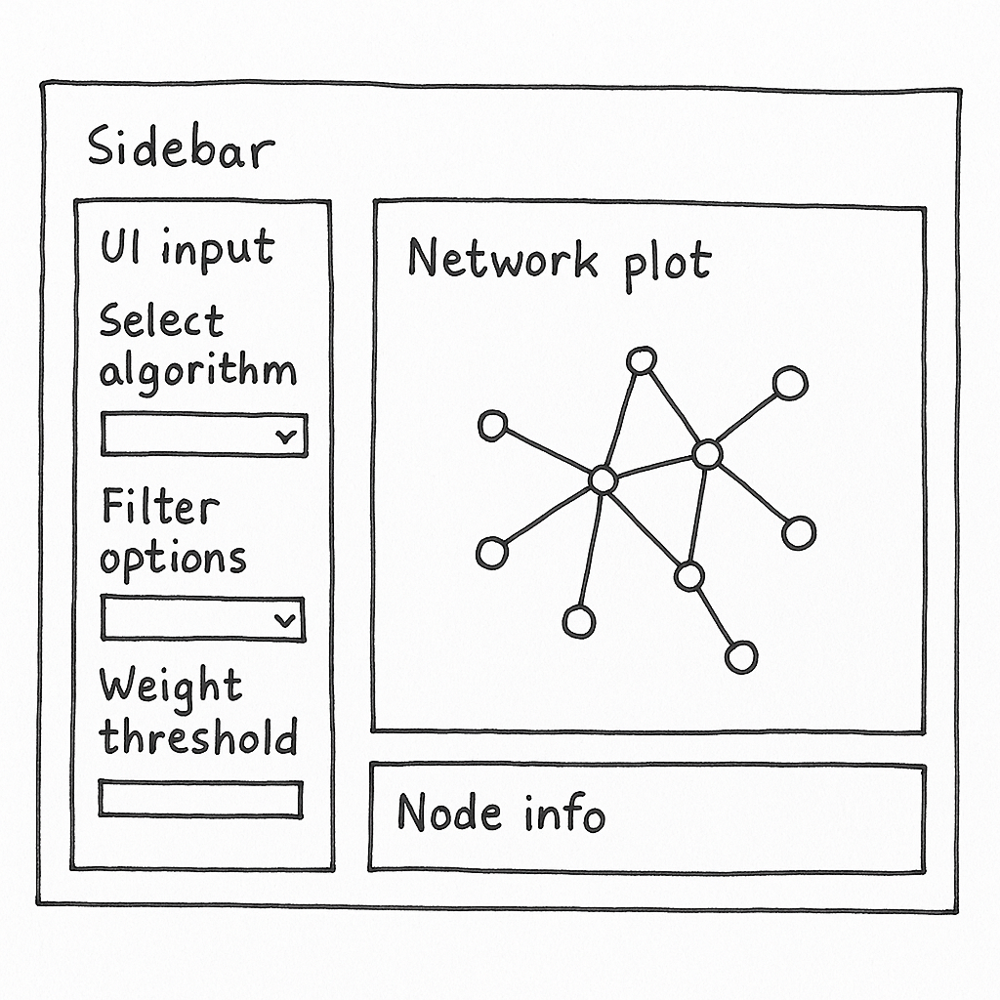

# Take-home Exercise 3: Prototype Module Designing – Community Detection and Pseudonym Network Exploration

## **The Task**

In this take-home exercise, you are required to select one of the module of your proposed Shiny application and complete the following tasks:

-   To evaluate and determine the necessary R packages needed for your Shiny application are supported in R CRAN,
-   To prepare and test the specific R codes can be run and returned the correct output as expected,
-   To determine the parameters and outputs that will be exposed on the Shiny applications, and
-   To select the appropriate Shiny UI components for exposing the parameters determine above.

------------------------------------------------------------------------

## **1. Introduction**

This prototype module is part of a larger visual analytics application for Mini-Challenge 3 (VAST Challenge 2025). It supports investigative journalist **Clepper Jessen** in uncovering hidden relationships and pseudonymous communication patterns within the radio transcript dataset of Oceanus.

The goal of this prototype is to storyboard and test a modular component that will eventually be integrated into the full Shiny application. The focus is on **community detection** and **interactive pseudonym analysis**, providing users with the ability to dynamically explore clusters of entities based on radio communication activity.

This document outlines the prototyping process, from data wrangling and method selection, to interactive interface design using Shiny components. The storyboard describes how different visual and interactive elements will work together to support investigative insights.

## **2. Data Preparation**

The source data is a knowledge graph in JSON format (`MC3_graph.json`) provided in the VAST Challenge 2025 Mini-Challenge 3. It consists of two primary components:

-   **Nodes**: Representing entities such as persons, vessels, places, and roles, each with metadata such as labels and types.
-   **Edges**: Representing communications between nodes with attributes such as sender, receiver, channel, date-time, and message weight.

### **Pre-processing Steps:**

The following R packages were used for data wrangling:

```{r, eval=FALSE}

library(tidygraph)
library(ggraph)
library(jsonlite)
library(dplyr)
```

The steps to prepare the data are as follows:

**Step 1: Load and Parse the JSON File**

```         
# Load the knowledge graph json_graph <- jsonlite::read_json("data/MC3_graph.json")
```

**Step 2: Extract and Structure Nodes and Edges**

```         
# Convert to tibble format nodes_tbl <- as_tibble(json_graph$nodes) edges_tbl <- as_tibble(json_graph$links)  # Rename and structure columns for compatibility nodes_tbl <- nodes_tbl %>% rename(id = id, label = name, type = entity_type) edges_tbl <- edges_tbl %>% rename(from = source, to = target)
```

**Step 3: Convert to a Tidygraph Object**

```         
graph_data <- tbl_graph(nodes = nodes_tbl, edges = edges_tbl, directed = TRUE)
```

**Step 4: Clean and Enrich the Graph**

```         
# Filter out edges with low weights or irrelevant connections (e.g., self-loops) graph_data <- graph_data %>%    activate(edges) %>%    filter(!is.na(from), !is.na(to)) %>%    filter(weight > 1) %>%    activate(nodes) %>%    mutate(degree = centrality_degree())
```

**Step 5: Verify Graph Summary**

```         
summary(graph_data)
```

These steps ensure that the data is converted into a tidy, filterable, and graph-compatible structure for community detection and interactive visualisation.

The core data transformation principles applied include:

-   **Parsed JSON using tidygraph and igraph** to build a directed graph structure from node-link format.
-   **Mapped entity metadata** to classify nodes into roles such as Person, Vessel, and Place.
-   **Filtered and simplified the graph**, including removal of self-loops and edges with insignificant weights to retain only meaningful relationships.
-   **Enriched nodes with centrality metrics**, particularly degree centrality, which is used for sizing and filtering nodes during visualisation.

## 3. Analytical and Visualisation Techniques

This module employs a dual-pronged analytical strategy that combines community detection algorithms with exploratory network visualization. These techniques allow the investigator to detect tightly linked communication subgroups, potentially exposing pseudonym clusters or coordinated behavior among vessels and individuals.

### Algorithms Used:

We adopted two widely recognized algorithms for graph community detection:

-   **Louvain Community Detection**: An unsupervised modularity-based approach that optimizes the partitioning of the graph into clusters. It is computationally efficient and ideal for detecting broad clusters in large-scale networks.
-   **Walktrap Community Detection**: Uses short random walks to find densely connected subgraphs. It is suitable for identifying smaller, more cohesive communities and capturing subtle relational dynamics.

Both algorithms produce numeric cluster IDs for each node, which are then used for node coloring and group-based filtering in the visual layer.

### Visualisation Approach:

Visualisation is a central element in this prototype, serving both as an exploratory and explanatory tool. Two main techniques were employed:

-   **Static Graphs using `ggraph`**: These are helpful during the analytical phase for layout calibration, edge density verification, and debugging of network transformations.
-   **Interactive Graphs using `visNetwork`**: These are deployed in the Shiny UI to support user-driven exploration. `visNetwork` provides pan, zoom, hover, and click functionality, which enhances pattern recognition and contextual analysis.

Color schemes were intentionally chosen to reflect community membership (via cluster ID), and node sizing was mapped to degree centrality to emphasize influence or activity within the graph.

Additional enhancements include:

-   Hover tooltips to display entity type and communication degree
-   Legend to distinguish nodes by category (Person, Vessel, Place)
-   Reactive filtering to isolate specific patterns of interest
-   **Static Graphs**: Using `ggraph` for initial exploration.
-   **Interactive Network**: Leveraging `visNetwork` for drilldown, tooltips, and filtering.

## 4. UI Design (Prototyping & Storyboarding)

This section emphasizes key prototyping principles outlined in the exercise brief:

1.  **Evaluation of R Packages from CRAN**: The prototype uses CRAN-supported packages such as `shiny`, `visNetwork`, `tidygraph`, `ggraph`, `igraph`, `jsonlite`, `dplyr`, and `DT`, all verified as stable and production-ready. This ensures compatibility and reduces technical risk when scaling the full Shiny application.

2.  **Validation of Functional Code**: All prototype components will be individually tested using RStudio. The pre-processing logic and community detection methods seek to ensure that it return correct outputs, and the visual network plot reacts dynamically to filtered inputs. Each Shiny UI input will be tied to a reactive server-side operation, tested both in isolation and in the Shiny runtime environment.

3.  **Definition of Inputs and Outputs**: Inputs include dropdowns for algorithm selection, checkboxes for entity filtering, and sliders for edge weight thresholds. Outputs include an interactive `visNetwork` graph, node information text display, and (optionally) an exportable snapshot. This alignment ensures clarity for both developers and users.

4.  **Shiny UI Component Selection**: Interface components are chosen to balance functionality and user experience:

    -   `selectInput()` offers a clear choice between Louvain and Walktrap algorithms.

    -   `checkboxGroupInput()` allows entity-specific filtering for targeted analysis.

    -   `sliderInput()` provides intuitive numeric filtering for graph density.

    -   `visNetworkOutput()` renders an interactive and scalable network layout.

    -   `verbatimTextOutput()` reveals node metadata for contextual interpretation.

These choices follow principles showcased in leading prototypes (e.g., Decoding Chaos and Tanzania Tourism), focusing on minimal cognitive load, fast responsiveness, and user-guided discovery.

To ensure clarity and usability, this module is designed using a storyboard-driven approach, inspired by best practices observed in exemplary prototype pages such as those from *Decoding Chaos* and *Tanzania Tourism Analysis*.

### Prototyping Strategy

Drawing inspiration from these references:

-   Use **incremental prototyping**: starting with static exploration, then layering interactivity.
-   Implement **modular design**: develop this as one self-contained component for integration into the larger app.
-   Include **user-centered workflows**: filters and actions modeled after investigative tasks (e.g., discovering who communicates frequently, identifying aliases).

### Storyboarding Process

1.  **Define User Goals**: Support Clepper in uncovering clustered interactions and pseudonym aliases.
2.  **Storyboard Sketching**: Initial wireframes were drafted to conceptualize component layout — influenced by those in the Decoding Chaos storyboard page.
3.  **Component-Task Mapping**: Every UI widget was explicitly mapped to a backend logic, ensuring traceability and transparency.

### Main Landing Page Mock-ups and Dashboard Style

To inform the visual language and layout of the Shiny application, our team designed a prototype landing page comprising several interlinked interface sections. These visuals illustrate the envisioned user interface and serve as references for component development.

#### 1. **Landing Cover Page (Team Identity)**

This mock-up establishes the visual identity and thematic branding for the dashboard. It reflects both the investigative tone of the VAST Challenge and our team’s creative approach. It includes a left navigation menu that guides users to each of the core question modules (Q1 to Q4), providing a consistent sidebar layout throughout the app.


#### 2. **Daily Radio Communication Volume (Q1A & Q1B)**

This section visualizes message frequency over time to detect periodicity or anomalies. It includes:

-   A dynamic bar chart summarizing total and average daily volume.
-   Interactive dropdown and hover tooltips for contextual exploration.

*This template serves as a reference for time-series visualizations to be integrated in future timeline-driven modules of the application.*


#### 3. **Entity Network Focus View – “Nadia Conti” (Q1C)**

This visual emphasizes network centrality and ego relationships. It includes:

-   Shapes and colors to differentiate entity types (e.g., vessel, organization, person).
-   A drop-down filter to focus on individual entities.

*This model informed the modular network layout used in our prototype for community and pseudonym analysis.*


#### 4. **Storyboard Sketch (Module Wireframe)**

This low-fidelity layout demonstrates the foundational module structure:

-   Left panel: Parameter controls
-   Right panel: Interactive graph and metadata display

It serves as the core layout pattern for the Shiny UI development, supporting Louvain/Walktrap switching, entity filters, and network interactivity.



### Planned Layout

The storyboard sketch and mock-ups reinforce a consistent modular layout adopted across the Shiny application. Each view uses a **sidebar-main panel split**, empowering users to choose algorithm types and entity filters on the left and observe dynamic network results on the right.

-   **Sidebar**: Control panel for selecting algorithm type, filtering entity type, and edge weight.
-   **Main Panel**: Interactive network with dynamic tooltips, zoom/pan, and metadata inspection.
-   **Tabbed Interface** *(optional)*: To toggle between community detection algorithms or show temporal comparisons.
-   **Export & Snapshot Option**: Allow user to capture the view for reporting.

#### Example UI Layout

Below is a simplified Shiny layout using `fluidPage()` to map this structure:

```{r, eval=FALSE}
#|code-fold: False

ui <- fluidPage(
  titlePanel("Community Detection & Pseudonym Explorer"),
  sidebarLayout(
    sidebarPanel(
      selectInput("algo", "Community Detection Algorithm", choices = c("Louvain", "Walktrap")),
      checkboxGroupInput("type", "Entity Types", choices = c("Person", "Vessel", "Place")),
      sliderInput("weight", "Minimum Edge Weight", min = 1, max = 10, value = 2)
    ),
    mainPanel(
      visNetworkOutput("net", height = "600px"),
      verbatimTextOutput("info")
    )
  )
)
```

This structure ensures responsiveness, clarity, and user engagement. The design accommodates future expansion while maintaining a low learning curve. Screenshots from earlier dashboard questions, such as the bar chart in Q1A&B and the entity-focused network of Q1C, served as design blueprints to guide the final implementation.

### UI Component Mapping

In addition to interactive graph exploration, this Shiny application supports tabulated results presented using the `DT` package. This enhances user control and discoverability when inspecting detailed data outputs such as entity centrality, community membership, or alias metadata.

### Interactive Tabulated Results

Using `DT::datatable()`, users can:

-   🔍 Search and filter across any column
-   🔼🔽 Sort by degree, cluster ID, type, or other attributes
-   🎯 Focus on specific entities or pseudonyms from the wider graph output

#### Example UI Integration

```{r, eval=FALSE}
mainPanel(
  DTOutput("result_table")
)
```

#### Server Logic Example

```{r, eval=FALSE}
output$result_table <- renderDT({
  datatable(df_results,
            options = list(
              pageLength = 10,
              autoWidth = TRUE,
              searchHighlight = TRUE
            ),
            rownames = FALSE,
            filter = "top",
            class = 'stripe hover compact')
})
```

This supports investigation workflows such as:

-   Listing top communicators by degree centrality
-   Exploring all known aliases and pseudonyms
-   Displaying communication volume by entity pairs

By embedding this alongside the network graph, the application delivers both **relational context** and **tabulated drilldown** capabilities, bridging visual insight with attribute-level data access.

| UI Component | Purpose |
|----|----|
| `selectInput("algo")` | Choose detection algorithm (Louvain/Walktrap) |
| `checkboxGroupInput("type")` | Filter node types (person, vessel, place) |
| `sliderInput("weight")` | Filter connections below weight threshold |
| `visNetworkOutput("net")` | Display interactive graph |
| `verbatimTextOutput("info")` | Node metadata panel |

**Design Learnings from References**

-   **Tanzania Tourism** emphasized clarity in visual transitions and guided storytelling.
-   **Decoding Chaos** used a modular dashboard and strong use of aspatial/geospatial splits — we aim to mirror this by making this module fully pluggable.
-   **Confirmatory Analysis** example showed the benefit of toggling between analytical models — we aim to adopt this in Louvain vs. Walktrap switch.

## 5. Parameters and Outputs

To make the Shiny application more engaging and insightful, we expand beyond core filters and outputs to include a wider array of interactive features.

### User Inputs:

|  |  |
|----|----|
| **Input Control** | **Description** |
| `selectInput("algo")` | Community detection method selector (Louvain or Walktrap) |
| `checkboxGroupInput("type")` | Entity type filter (Person, Vessel, Place) |
| `sliderInput("weight")` | Minimum edge weight threshold to reduce noise |
| `selectInput("focus_entity")` | Focus on a particular entity (e.g., Nadia Conti) to show ego network |
| `checkboxInput("highlight_alias")` | Toggle to highlight entities suspected of pseudonym usage |
| `dateRangeInput("comm_range")` | Select time window to filter communication edges |
| `selectInput("cluster_id")` | Filter or highlight a specific cluster based on detection algorithm |

### Application Outputs:

|  |  |
|----|----|
| **Output Component** | **Description** |
| `visNetworkOutput("net")` | Interactive network showing colored clusters and filtered edges |
| `verbatimTextOutput("info")` | Metadata of selected node (e.g., name, type, degree) |
| `plotOutput("timeline_plot")` | Communication volume over time (to be integrated) |
| `DTOutput("result_table")` | Tabular view of nodes or edges with filtering and sorting features |
| `downloadButton("export_plot")` | Export current network view as image or snapshot |
| `textOutput("cluster_summary")` | Summary statistics for selected community cluster |

### Interactivity Expansion Ideas:

-   **Drill-down via double-click**: Expand a node to show direct neighbors
-   **Brushing and linking**: Select nodes from network to highlight rows in table
-   **Dynamic color mapping**: Toggle between cluster ID, entity type, or degree centrality as node color basis
-   **Topic integration**: Add top-communicated keywords per cluster in hover tooltip or side display
-   **Alias grouping**: Visually link nodes suspected to share the same pseudonym

These enhancements not only add usability and depth, but also align tightly with the investigative workflow Clepper is likely to pursue — identifying leads, tracking influence, and exposing deceptive practices over time.

### User Inputs:

-   Community detection algorithm
-   Entity type filter
-   Weight threshold

### Application Outputs:

-   Network plot (interactive, color-coded clusters)
-   Node metadata when clicked
-   Exportable graph snapshot (optional)

## 6. Prototype Code Snippets

```{r, eval=FALSE}

# Community Detection
graph_louvain <- graph_data %>% 
  mutate(community = group_louvain())

# Interactive Plot
output$net <- renderVisNetwork({
  filtered <- graph_louvain %>% activate(edges) %>% filter(weight >= input$weight)
  visNetwork(filtered)
})
```

## 7. Reflections and Next Steps

This Take-home 3 prototype marks a successful first implementation of a modular Shiny component tailored for investigative visual analytics. It showcases the power of combining community detection algorithms, interactive network diagrams, and dynamic filtering interfaces to surface hidden communication patterns and pseudonym dynamics in a complex dataset.

Key strengths of this prototype include:

-   A tested and extensible data pipeline for converting JSON-based knowledge graphs into tidygraph objects
-   Well-integrated community detection logic (Louvain and Walktrap)
-   A modular and visually consistent user interface grounded in investigative needs
-   Effective alignment between network visualisation and tabular insight via linked interactivity

This prototype also reflects lessons learned from top-performing prior projects (e.g., Decoding Chaos, Tanzania Tourism) in terms of storyboarding, modular UI planning, and interaction design.

### Proposed Next Steps

To scale this prototype into a full-featured module within the final application, the following development goals are recommended:

-   **Integrate Timeline Filtering**: Allow communication edges to be filtered by date range using `dateRangeInput()`.
-   **Implement Pseudonym Disambiguation**: Build logic to identify and visually cluster suspected pseudonym aliases across multiple entities.
-   **Topic Enrichment**: Associate dominant message themes with detected communities using keyword extraction or topic modeling.
-   **Brushing & Linking**: Enable node selections in the network to highlight related records in the tabular view, enhancing discoverability.
-   **Geospatial Integration**: Add optional map-based view to connect network dynamics to spatial context (if vessel coordinates or harbor data is available).
-   **Scenario Testing**: Validate with real investigative use cases by simulating Clepper Jessen’s workflow end-to-end.

With these enhancements, the application can evolve into a powerful and intuitive investigative platform — revealing who is connected, how they communicate, and which identities may be intentionally obscured.
